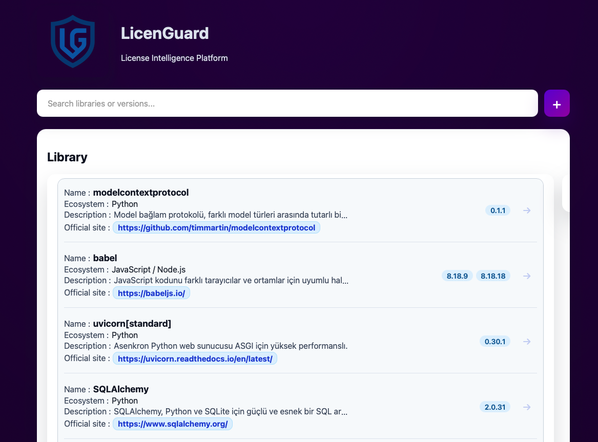
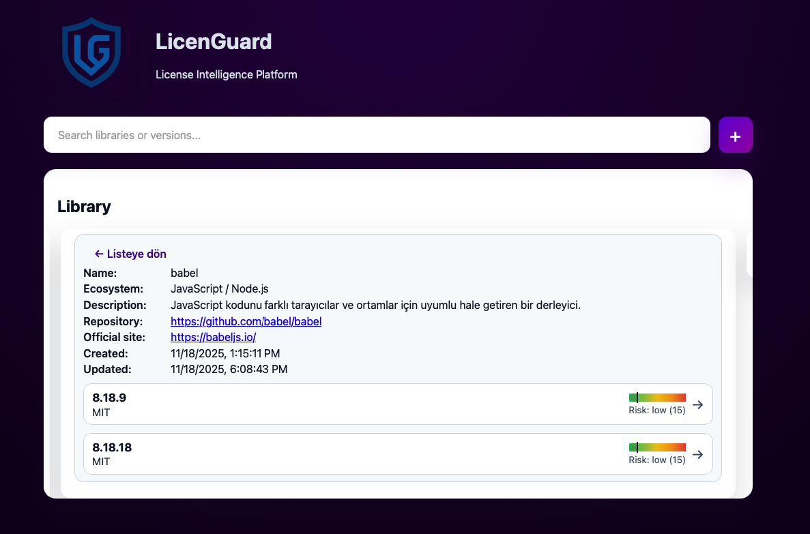
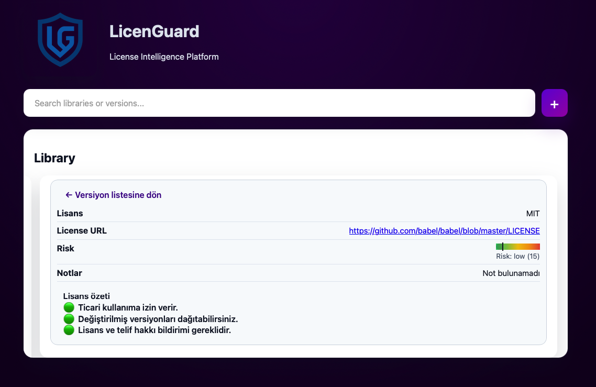
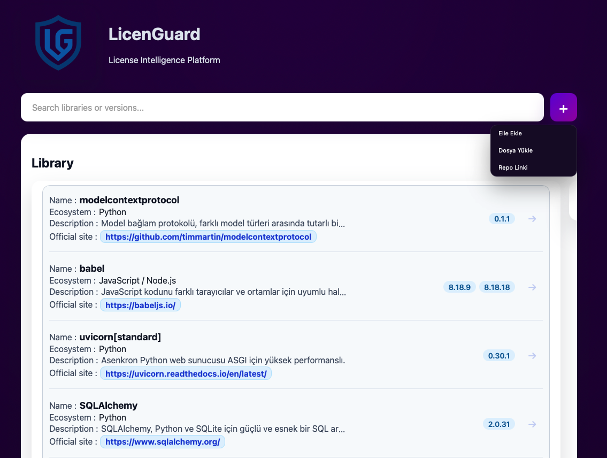
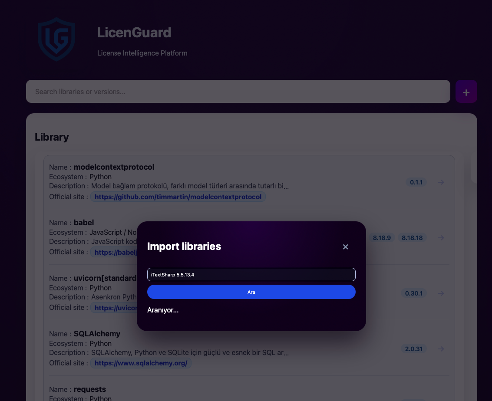
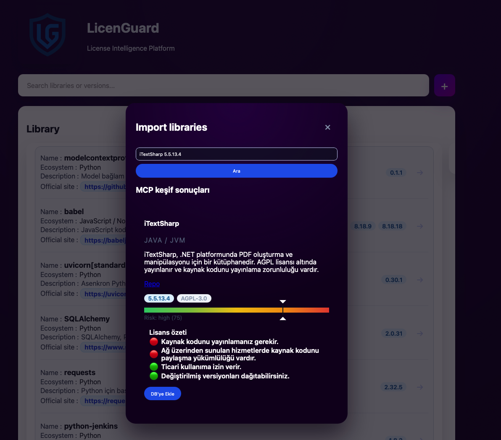
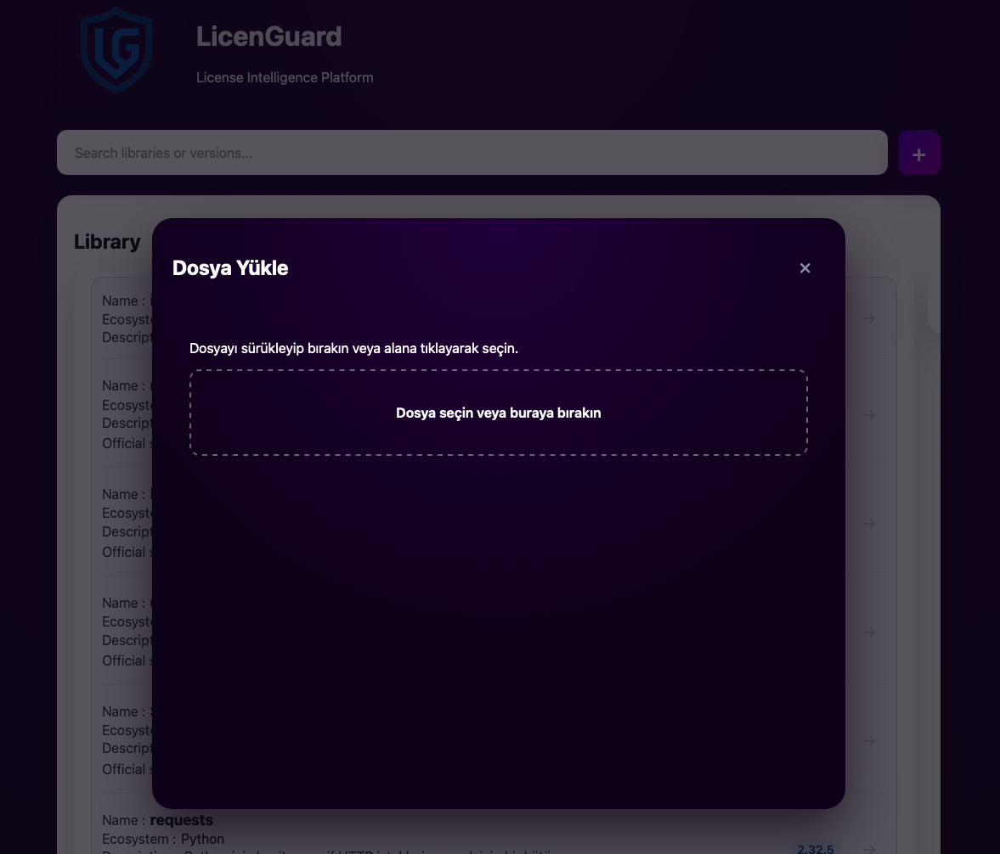
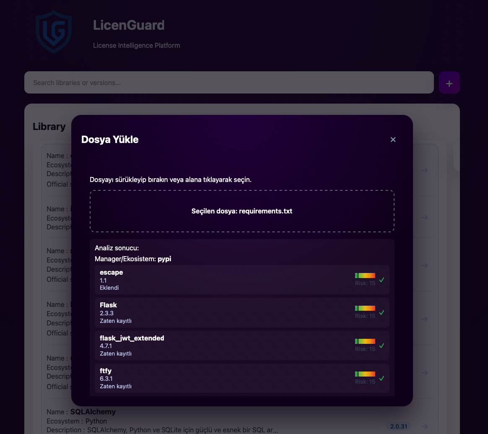
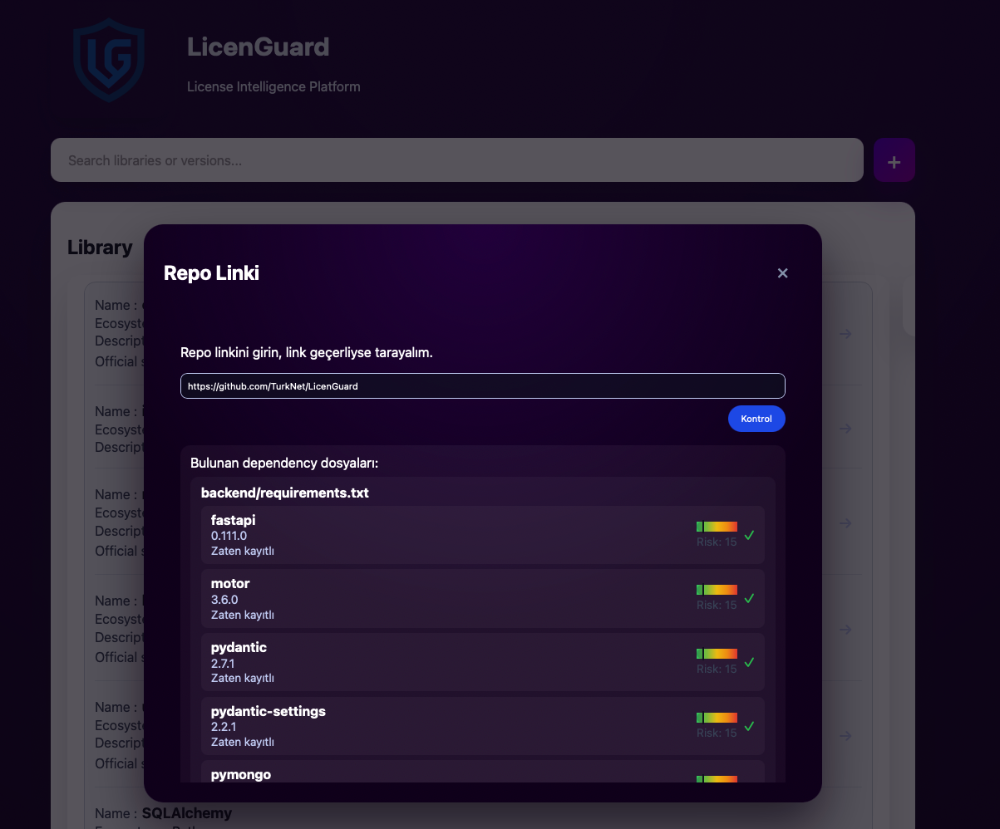
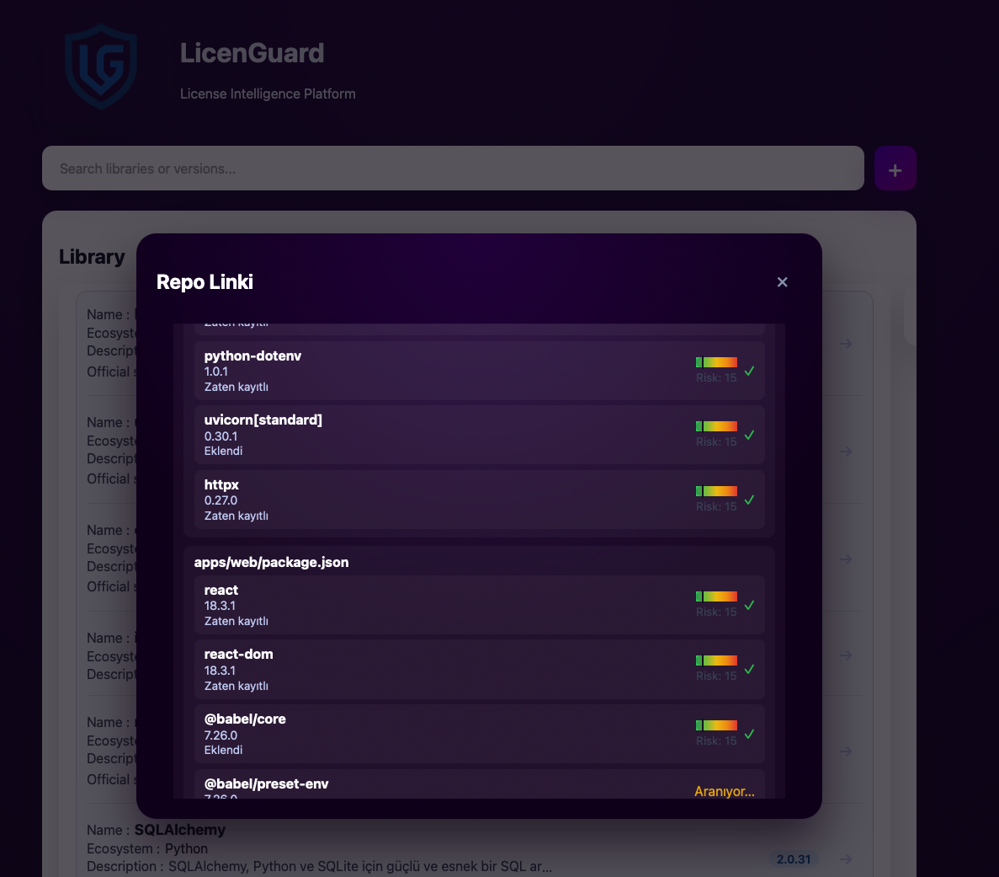

# LicenGuard

Monorepo that inventories internal OSS dependencies (C#, Node.js, Python, Java, etc.), stores their license metadata in MongoDB, exposes a Python API, React dashboard, and optional MCP server for AI copilots.

## Architecture

```
backend/                 # FastAPI + MongoDB backend (MVC structure)
apps/web/                # React UI (Webpack, JavaScript)
servers/mcp-licenguard/  # MCP server bridging the API to copilots
```

- **Backend (Python/FastAPI)** – Implements models/controllers/views so each library entry carries multiple versions with license names + URLs.
- **Web UI (React)** – Simple dashboard to add libraries, append versions, and visualize license coverage.
- **MCP server (Node)** – Optional bridge so IDE/chat agents can fetch libraries or drill into a component.

## Backend setup

```bash
cd backend
python3 -m venv .venv
source .venv/bin/activate
pip install -r requirements.txt
cp .env.example .env
python seed.py   # optional sample data
uvicorn app.main:app --reload --port 4000
```

MongoDB defaults to `mongodb://localhost:27017/licenguard`. Adjust `.env` to point at any cluster.

## Web UI setup

```bash
npm install
npm run dev --workspace @licenguard/web
# build with npm run build --workspace @licenguard/web
```

Set frontend env vars via your shell (e.g. `API_URL`/`VITE_API_URL`) if the backend is not on `http://localhost:4000`.

## MCP server

```bash
cd servers/mcp-licenguard
npm install
API_URL=http://localhost:4000 npm run dev
```

Register the MCP binary with your preferred tool (e.g. Claude, VS Code) to browse license data without leaving chat.

## MongoDB data shape

```json
{
  "_id": "6650f7ab5b4c4e2b3c1a1234",
  "name": "express",
  "ecosystem": "npm",
  "description": "Fast, unopinionated, minimalist web framework for Node.js",
  "repository_url": "https://github.com/expressjs/express",
  "officialSite": "https://expressjs.com",
  "versions": [
    {
      "version": "4.19.2",
      "license_name": "MIT",
      "license_url": "https://opensource.org/licenses/MIT",
      "notes": "Detected via LICENSE and package.json",
      "license_summary": [
        { "summary": "Permissive for commercial use", "emoji": "✅" },
        { "summary": "Requires copyright + license notice", "emoji": "ℹ️" }
      ],
      "evidence": [
        "LICENSE",
        "package.json:license"
      ],
      "confidence": 0.94,
      "risk_level": "low",
      "risk_score": 12,
      "created_at": "2024-06-01T12:00:00Z"
    }
  ],
  "created_at": "2024-06-01T12:00:00Z",
  "updated_at": "2024-06-01T12:00:00Z"
}
```

This normalized format keeps each OSS component and version audit-ready, with evidence, summaries, and risk scoring captured alongside license metadata.

## Screenshots

| View |
| --- |
| **Main dashboard**<br/> |
| **Version list**<br/> |
| **Version details**<br/> |
| **Navigation**<br/> |
| **Manual search**<br/> |
| **Manual results**<br/> |
| **File upload**<br/> |
| **Upload completed**<br/> |
| **Repo search**<br/> |
| **Repo results**<br/> |
